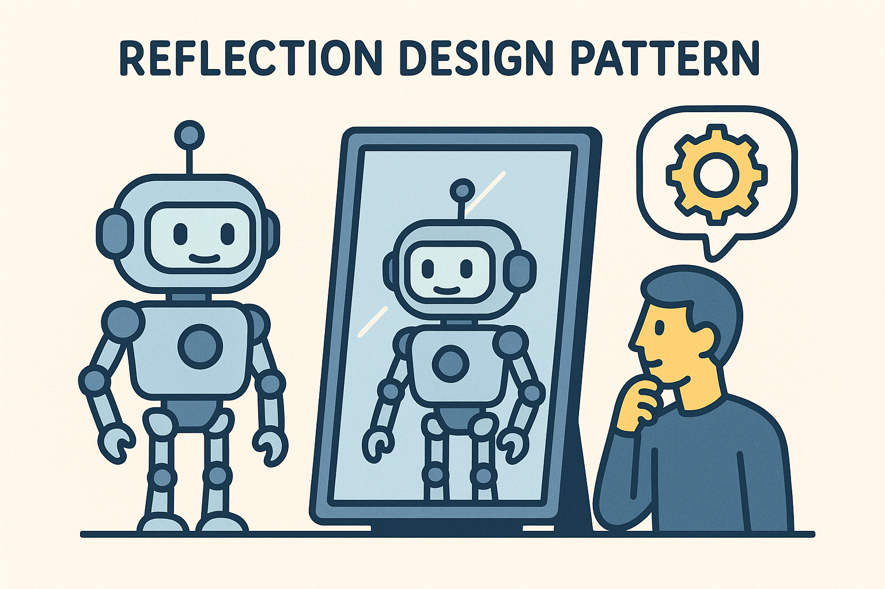
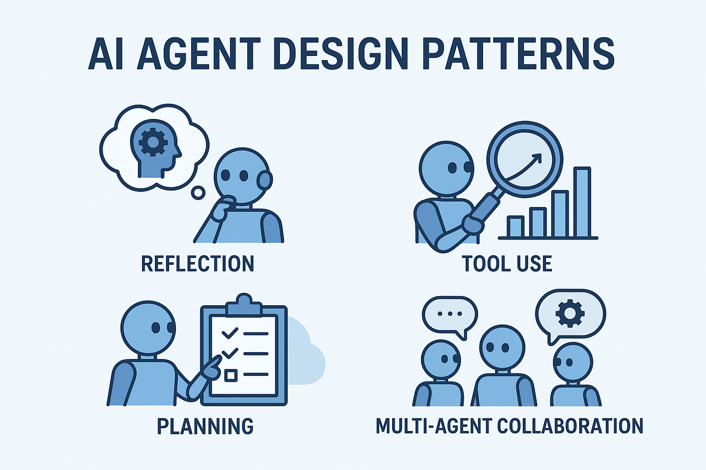
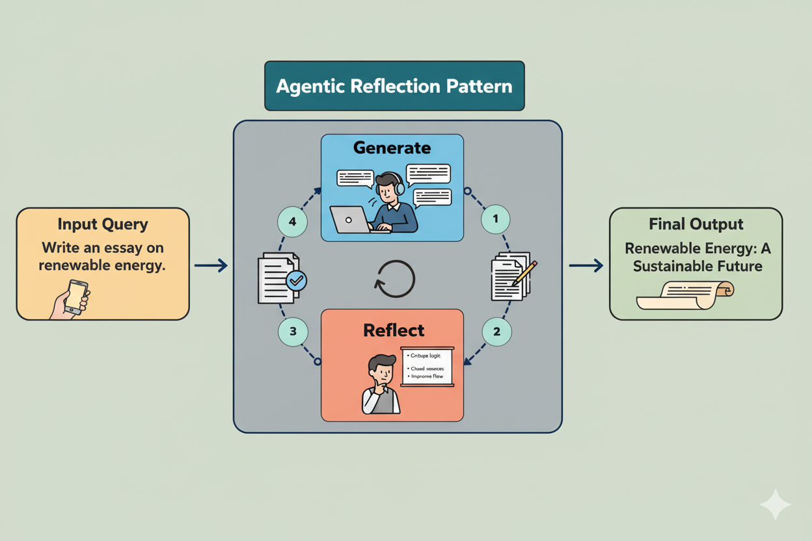

# Reflection-Agents-Tutorial-
Learn how to build a reflection-style AI agent that writes, critiques, and improves essays with Gemini.
🪞 Reflection Agents – Moving Beyond Single-Pass AI

Over the last couple of years, AI models haven’t just been getting smarter — they’ve been learning to work as part of larger, more intelligent systems.
That’s where Agentic Design Patterns come in. Think of them as architectural blueprints — guiding how agents, tools, and workflows come together to build scalable, adaptive, and self-improving AI systems.
If you’re getting into AI, this is a trend worth paying attention to.
💭 Why Reflection Matters
Right now, most of us use models like ChatGPT or Gemini in what’s called zero-shot mode:
we give them a single prompt and expect a perfect answer in one go.
But imagine asking a human to write a full essay without planning, revising, or even using backspace — just one perfect attempt. Sounds unrealistic, right?
And yet, that’s exactly how most AI generation still works.
What if we didn’t stop there?
What if we let models work like human writers — starting with an outline, drafting, reflecting, critiquing, and refining?
That’s the idea behind Reflection Agents — a pattern where AI models generate, evaluate, and improve their own outputs in a self-driven feedback loop.
🧠 What Is the Reflection Pattern?

The Reflection Pattern is one of the four core Agent Design Patterns described by DeepLearning.AI and Andrew Ng, alongside:
Tool Use Pattern
Planning Pattern
Multi-Agent Collaboration Pattern
Each of these patterns helps us structure intelligent workflows where AI acts more like a team of thinkers than a one-shot oracle.
The Reflection Pattern, specifically, gives the AI the ability to analyze and refine its own reasoning or writing.
It’s a form of self-critique — allowing the model to loop through generate → reflect → refine cycles until it reaches a stronger result.
🔁 How the Reflection Loop Works
Let’s visualize it:

Generate Block
The user gives a prompt — for example, “Write an essay on renewable energy.”
The model produces the first draft.
Reflect Block
Another instance of the same model steps in as a critic.
It reviews the essay, points out flaws, suggests improvements, and returns structured feedback.
Refine Block
The feedback is then passed back to the writer role.
Using the critique, the model rewrites and improves its essay — making it clearer, more accurate, and more engaging.
Repeat the Cycle
This loop can run multiple times.
Each iteration produces a more refined version.
You can stop after a fixed number of iterations, or even add a condition like:
“Exit when the reflection block says the result is good enough.”
The result is a self-improving agent — one that learns from its past outputs just like a human revising their work.
🔬 Why This Matters
Reflection transforms AI from a reactive tool into a proactive learner.
Instead of answering once and stopping, the agent learns from each iteration — becoming more aligned, coherent, and trustworthy.
It’s the same logic that underpins human learning, scientific method, and debugging.
You try, fail, reflect, and improve.
This pattern doesn’t just make models better writers — it makes them better thinkers.
🧩 Where It Fits in Agentic AI
Reflection Agents form the foundation of more complex agentic systems, including:
Planning Agents, which map out multi-step goals before execution.
Tool-Using Agents, which call APIs or external resources as needed.
Collaborative Agents, which communicate and negotiate with other models.
Together, these patterns form the backbone of modern agentic design — the movement toward AI systems that can reason, act, and adapt.
🧠 Learn by Building
In this repository, you’ll find a minimal working example that demonstrates the Reflection Pattern in action using Gemini.
It’s a simple agent that:
Writes an essay,
Critiques its own work,
And refines it through multiple iterations.
This is just the starting point — a sandbox to explore how AI self-improvement loops work under the hood.
📺 Watch the Tutorial
I’ve also made a video walking through everything — from the theory to the implementation.
🎥 [YouTube link coming soon]
If you’re curious about Planning Agents, Tool-Using Agents, and Multi-Agent Systems, stay tuned — they’ll be covered in future episodes.
🌍 Credits & Inspiration
DeepLearning.AI – Agentic Design Patterns
Andrew Ng’s insights on Agent Workflows
Google Gemini API
